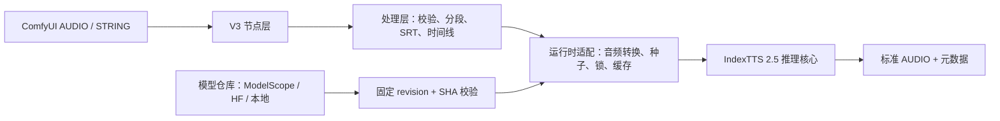

# T8star-Aix · ComfyUI IndexTTS 2.5 节点规划

> 状态：历史架构规划 / 已实现并持续维护（当前 Node 0.21.4、Desktop 0.22.3）
> 目标：把当前正式版 IndexTTS 2.5 能力做成稳定、易装、可复现、与 ComfyUI 音频生态互通的自定义节点包。  
> 当前代码基线：`index-tts/index-tts@ee40fa7d6c6b8a2c7f06105f9f1e65775b74868c`  
> 模型基线：`IndexTeam/IndexTTS-2.5@ba2480d9f7f629eb18f6acaebb357679d9ba88a4`

> 本文保留最初的架构决策和验收理由，不再表示功能尚未开发。实际发布状态、后续事项和验收记录
> 以节点仓库 `roadmap.md`、中英文 README 及 GitHub Release 为准。P0/P1/P2 节点、SRT 多角色、
> 音色库、ASR、时间轴、加速诊断、模型修复下载与 Registry 发布均已完成。

### 2026-08-30 实施快照

- ComfyUI 使用原生 V3 schema、标准 `AUDIO`、独立控制对象和 33 组 UI/API 示例工作流。
- Desktop 支持可恢复多角色工程、音色包、签名自动更新、长文本保护和内部单段重做。
- 两端共享五语言、情感、发音、时长、参考缓存和跨段语速保护核心。
- 新增五语言真实音质回归工具，固定记录 CER/WER、语速波动、削波、静音、时长、RTF 和峰值显存。
- `indextts.cli` 已切换为正式 IndexTTS 2.5 路径，不再调用旧 IndexTTS 1.x 推理类。

## 1. 结论先行

推荐做成独立发布的 `ComfyUI-IndexTTS25` 节点包，品牌显示为 `T8star-Aix · IndexTTS 2.5`，但推理核心与当前项目共用同一份 2.5 源码基线和模型清单。

首个正式版不应只有一个塞满参数的“大节点”，也不应复制十几个相互重复的生成节点。推荐使用“加载器 + 生成器 + 可组合控制对象”的结构：

1. 基础用户只需：核心 `Load Audio` → 模型加载器 → 基础生成器 → 核心 `Preview Audio`。
2. 情感、采样、发音、角色等进阶能力通过独立构建节点接入，不污染基础节点。
3. 所有音频输入输出使用 ComfyUI 标准 `AUDIO`，不自建 Save/Load Audio 节点。
4. 模型统一放在 `ComfyUI/models/TTS/IndexTTS-2.5/`，支持 `extra_model_paths.yaml`。
5. 只支持正式 IndexTTS 2.5，不兼容或伪装成 2.0。
6. 模型不随节点代码打包；提供 ModelScope/Hugging Face 下载、断点续传和 SHA256 校验。
7. 首先解决依赖兼容、显存复用、确定性种子、取消任务和错误提示，再扩展 SRT 等大功能。

## 2. 当前项目可直接复用的能力

当前 `IndexTTS2.infer()` 已具备：

- 零样本音色克隆：`spk_audio_prompt`。
- 五语种：中文、英文、日语、西班牙语、阿拉伯语。
- 情感参考音频与强度混合。
- 8 维情感向量：高兴、愤怒、悲伤、恐惧、厌恶、低落、惊讶、平静。
- 自然语言情感描述，由 QwenEmotion 转换为情感向量。
- 正式 2.5 时长系数 `duration_factor`。
- 基于 Token 预算的长文本分段和段间静音。
- `do_sample`、`temperature`、`top_p`、`top_k`、`num_beams`、`repetition_penalty`、`max_mel_tokens` 等生成参数。
- 发音标注 `<文字|发音>` 和文本标准化开关。
- CUDA、CPU、MPS、XPU 设备分支，以及 BF16、CUDA kernel、DeepSpeed、torch.compile 等加载选项。
- 说话人/情感条件缓存、低显存自动分段、流式生成器接口。

需要适配而不能直接暴露的地方：

- 推理核心接收参考音频文件路径，而 ComfyUI 传入标准 `AUDIO` Tensor。
- 推理无输出文件时返回 `(22050, int16 ndarray)`，需要安全转换为 `[B,C,T]` 的浮点 Tensor。
- 模型对象有内部条件缓存，是有状态对象；并行执行必须加模型级锁。
- 情感文本功能只有加载 QwenEmotion 后才能使用，不能在运行中无提示失败。
- Python、PyTorch、Transformers 的严格版本直接安装进 ComfyUI 可能破坏其他节点。

## 3. 主流 TTS 节点调研结论

| 参考项目 | 值得吸收 | 不直接照搬 |
|---|---|---|
| [TTS Audio Suite](https://github.com/diodiogod/TTS-Audio-Suite) | 统一处理层、长文本、SRT、多角色、分段缓存、参数标签、脆弱依赖隔离 | 多引擎和大量后期节点超出本项目范围，维护面过大 |
| [ComfyUI-F5-TTS](https://github.com/niknah/ComfyUI-F5-TTS) | 基础克隆路径短、多角色文本标记、简单/高级工作流 | Git submodule 与手工补丁安装体验不适合作为发布基线 |
| [ComfyUI-QwenTTS](https://github.com/1038lab/ComfyUI-QwenTTS) | 基础/高级分层、可复用语音、标准模型目录、多设备、卸载选项 | IndexTTS 不具备的 Voice Design 不能虚构实现 |
| [ComfyUI-OmniVoice-TTS](https://github.com/Saganaki22/ComfyUI-OmniVoice-TTS) | 智能长文本、自动 offload、模型缓存失效、多人对话与非语言标签的交互经验 | 不移植模型原生不支持的 600 语种和声音设计能力 |
| [ComfyUI-kaola-IndexTTS2](https://github.com/kana112233/ComfyUI-kaola-IndexTTS2) | 三种情感入口、标准 AUDIO、SRT 角色配音 | 它面向 IndexTTS 2.0、角色槽固定为 7 个、缺少正式 2.5 语速与模型完整性锁定 |
| [ComfyUI-KokoroTTS](https://github.com/benjiyaya/ComfyUI-KokoroTTS) | 最短基础工作流、语音选择与标准 AUDIO 输出 | 单节点过简，无法承载 IndexTTS 的情感与生产控制 |
| [ComfyUI ElevenLabs Partner Nodes](https://blog.comfy.org/p/elevenlabs-is-now-available-in-comfyui) | TTS、对话、语音转换、字幕等能力拆成独立可组合节点 | 本地 IndexTTS 首版不扩展为 ASR、VC 或声音特效平台 |

调研后的产品原则：基础生成保持短路径；复杂能力通过组合节点完成；模型路径、语音预设、缓存、错误恢复属于正式功能，不是“后面再补”的工程细节。

## 4. 技术与发布架构

### 4.1 推荐包结构

```text
ComfyUI-IndexTTS25/
├─ __init__.py                  # ComfyUI 入口/节点注册
├─ pyproject.toml               # Registry 元数据和语义版本
├─ requirements.txt             # 最小依赖；禁止覆盖 ComfyUI 的 torch
├─ LICENSE / LICENSE_ZH.txt
├─ THIRD_PARTY_NOTICES.md
├─ manifests/
│  └─ model_2_5.json            # 固定 revision、大小、SHA256
├─ indextts/                    # 经审计的正式 2.5 核心快照
├─ nodes/
│  ├─ model_nodes.py
│  ├─ generation_nodes.py
│  ├─ emotion_nodes.py
│  ├─ settings_nodes.py
│  ├─ voice_nodes.py
│  └─ script_nodes.py
├─ runtime/
│  ├─ adapter.py                # IndexTTS ↔ ComfyUI AUDIO
│  ├─ model_cache.py
│  ├─ reference_cache.py
│  ├─ seed_scope.py
│  └─ dependency_probe.py
├─ services/
│  ├─ model_store.py
│  ├─ downloader.py
│  ├─ segmentation.py
│  ├─ timeline.py
│  └─ metadata.py
├─ example_workflows/
└─ tests/
```

正式发布建议使用独立节点仓库，避免 ComfyUI Manager 安装当前桌面版 `pyproject.toml` 中精确锁定的 Torch/CUDA/Gradio 依赖。核心代码不使用 Git submodule，以免 Manager/ZIP 安装时缺文件；通过 revision manifest 和同步脚本记录上游来源。

### 4.2 分层职责



节点层不直接写临时文件、下载模型或操作全局随机数；这些工作分别由适配层和服务层负责。

### 4.3 ComfyUI 规范

- 首版采用官方 V3 Schema：`comfy_api.latest.io.ComfyNode`、`define_schema`、`io.NodeOutput`、`ComfyExtension/comfy_entrypoint`。
- `AUDIO` 必须是 `{"waveform": Tensor[B,C,T], "sample_rate": int}`。
- 首次兼容性冲刺决定最低 ComfyUI 版本；首版 V3-only，不同时维护未经完整测试的 V1 分支。
- 使用 ComfyUI 进度条，并在每段生成前后检查中断信号。
- V3 节点类视为无状态；模型由 Loader 输出的 pipeline handle 和线程安全运行时管理器持有。
- 种子是显式输入；使用 V3 `fingerprint_inputs` 精确控制缓存，不强制每次重跑。
- 注册全局唯一节点 ID，统一前缀 `T8_IndexTTS25_`，菜单分类 `T8star-Aix/Audio/IndexTTS 2.5`。

## 5. 节点规格

### 5.1 P0：首版必须完成

首个公开稳定版控制为 4 个节点。模型下载器、语音库和 SRT 不进入首版节点契约，避免在依赖兼容性尚未证明时扩大维护面。

#### A. IndexTTS 2.5 Model Loader

输入：

- `model`: 从 `ComfyUI/models/TTS/IndexTTS-2.5/` 枚举。
- `device`: auto / cuda / cpu；其他设备经测试后开放。
- `precision`: auto / bf16 / fp32。
- `memory_policy`: keep_loaded / release_after_run。

输出：`INDEXTTS25_MODEL` 轻量句柄，而不是在工作流 JSON 中序列化模型。

行为：按“模型路径 + revision + device + precision”复用单例；启动 ComfyUI 时不得加载权重或联网。模型缺失或校验失败时给出 ModelScope/Hugging Face 两条恢复路径和准确文件名。

首版不暴露 CUDA 自定义核、DeepSpeed、GPT latent、torch.compile 等未经多环境实测的内部开关。QwenEmotion 在第一次真正使用文本情感时懒加载，且不能用 `device_map=auto` 私自占用其他 GPU。

#### B. IndexTTS 2.5 Generate Speech

基础输入：

- `model`: `INDEXTTS25_MODEL`。
- `text`: 多行 STRING。
- `speaker`: 标准 `AUDIO`。
- `language`: ZH / EN / JA / ES / AR。
- `duration_factor`: 0.5–2.0，默认 1.0；界面注明“小于 1 更快，大于 1 更慢”。
- `seed`: ComfyUI 标准种子控件。

可选输入：

- `emotion`: `INDEXTTS25_EMOTION`。
- `settings`: `INDEXTTS25_SETTINGS`。

输出：

- `audio`: 标准 `AUDIO`，22050 Hz、单声道、有限浮点值。
- `info`: JSON STRING，记录模型 revision、seed、语言、时长系数、分段、耗时、RTF、警告。

默认值以稳定为先：`do_sample=False`；高级采样必须由 Settings 显式开启。

#### C. Emotion Control

使用 V3 `DynamicCombo` 在一个节点中只显示当前模式需要的字段，输出统一 `INDEXTTS25_EMOTION`：

1. `reference_audio`：标准 AUDIO + 情感强度 0–1。
2. `vector`：8 个强度和情感样本随机化开关；清楚显示固定顺序；总强度超过官方 0.8 安全范围时归一化并写入 warning。
3. `text`：独立情感描述可空；空表示分析正文；强度默认建议 0.6。

文本模式第一次实际使用时才加载 QwenEmotion；不可用时给出可操作错误，不让基础生成额外占用显存。

#### D. Sampling Config

输入：

- `do_sample`、`temperature`、`top_p`、`top_k`。
- `num_beams`、`repetition_penalty`、`length_penalty`。
- `max_mel_tokens`、`max_text_tokens_per_segment`。
- `segment_silence_ms`、`text_normalization`。

输出：`INDEXTTS25_SETTINGS`。所有字段写入生成元数据，保证工作流可复现。

当 `do_sample=False` 时，界面和 metadata 明确标记 temperature/top-p/top-k 被忽略。

### 5.2 P1：实用进阶能力

#### E. Model Setup / Verify

- 提供一次性 CLI/安装工具，验证、补全或修复模型；是否再提供工作流节点由首版用户反馈决定。
- ModelScope / Hugging Face 固定正式 2.5 revision，支持断点续传、文件锁、SHA256、临时名和原子替换。
- 首次下载前显式确认模型协议；不在运行时执行 pip。

#### F. Voice Profile / Voice Library

- 从标准 AUDIO 创建带名称、语言、备注和内容哈希的 `INDEXTTS25_VOICE`。
- 可从 `ComfyUI/input/IndexTTS25/voices/` 加载预设。
- 预设只保存参考音频和 JSON 元数据，不保存模型内部 Tensor，升级模型后不会失效。
- 参考音频按内容哈希规范化为缓存 WAV，复用说话人条件，避免每次重写临时文件。

#### G. Long-form Generation

不再建立另一个重复的 TTS 参数面板，而是在 Generate Speech 内启用生产级长文本处理：

- 官方 Token 分段作为默认策略。
- 标点优先、保护发音标注、不拆数字/英文缩写。
- 段间静音、短淡入淡出和可选等响度拼接。
- 分段级缓存：只重新生成文本、声音、情感或参数发生变化的段。
- 中断后可复用已完成段。
- 输出 segment manifest JSON，记录每段文本、seed、时长和警告。

发音控制保留 Generate 正文中的官方 `<文字|发音>` 语法，同时提供纯文本 `T8_IndexTTS25_Pronunciation` V3 节点。该节点负责工作流内嵌词典、长词优先替换、手工标注保护、中英日读音校验和转换结果报告，不持有或修改模型状态。

#### H. Role Bank / Sequential Dialogue

- V3 Autogrow 接入 1–8 个 Voice Profile，角色名称唯一，支持默认旁白。
- 解析 `角色：台词`，顺序生成并插入静音，输出合并 AUDIO 和段落 manifest。
- 实现前先把“按内容哈希缓存多个说话人条件”做完；当前核心只缓存最后一个说话人，不能直接用于角色来回切换。

### 5.3 P2：配音生产能力

#### I. SRT / Script Parser

- 输入标准 SRT 或 `角色：台词` 脚本。
- 支持 `角色(情感描述)：台词`。
- 输出结构化 `INDEXTTS25_SCRIPT`、规范化 SRT 和校验报告。
- 未知角色、重叠时间、倒序时间码、空台词在推理前一次性报告。

#### J. Multi-character Dubbing

输入：模型、脚本、Voice Bank、默认设置。输出：完整 AUDIO、实际 SRT、segment manifest。

时间线策略：

1. `sequence`：只保持字幕顺序，不承诺原时间码。
2. `timeline`：按开始时间补静音；超出槽位时保留完整语音并输出漂移报告，不静默截断。
3. `overlay`（高级）：严格按原始时间戳叠放，允许有意的多人重叠；默认对意外重叠报错。

官方 `duration_factor` 只能称为时长倍率，不能宣传为精确到秒或“自动对口型”。基于二次生成或 time-stretch 的 `fit_slot` 仅在质量实验通过后另列实验功能。

进阶标签只采用白名单解析，例如语言、seed、speed、emotion、pause；禁止 `eval/exec`。

## 6. 运行时、模型和依赖策略

### 6.1 标准模型目录

```text
ComfyUI/models/TTS/IndexTTS-2.5/
├─ config.yaml
├─ gpt.pth
├─ codec.pth
├─ s2mel.pth
├─ qwen0.6bemo4-merge/
└─ ...其余正式清单文件
```

通过 `folder_paths.add_model_folder_path("TTS", ...)` 或当前 ComfyUI 等价 API 注册目录，并尊重 `extra_model_paths.yaml`；不硬编码用户绝对路径。

### 6.2 依赖兼容优先级

已经核实的硬冲突是：正式 2.5 上游 `pyproject.toml` 要求 Python `>=3.10,<3.12`、`torch==2.8.*`、`transformers==4.52.1`、`tokenizers==0.21.0`；当前 ComfyUI 主线允许 Python `>=3.10`，当前 NVIDIA Portable 默认 Python 3.13 / PyTorch CUDA 13.0，且主线只约束 `transformers>=4.50.3`。因此，直接让 Manager 安装本项目根依赖是不可接受的。当前工作区为了桌面整合已放宽 Python 版本，这也不能当作 3.12/3.13 已兼容的证据。

1. 不在 `requirements.txt` 中安装或降级 `torch`、`torchvision`。
2. `torchaudio` 必须与现有 Torch ABI 匹配；缺失时给出命令，不自动 pip。
3. Phase 0 必须分别测试 Python 3.12 和 3.13，不把当前桌面整合包的 Python 3.10 测试结果当作 ComfyUI 兼容证据。
4. 先让核心兼容当前 ComfyUI 主流 Transformers 版本；不因节点安装全局降级 Transformers。
5. Phase 0 若证明无法原生兼容，再设计“用户显式安装”的隔离 sidecar；不得在节点执行时创建环境或 pip install。
6. 导入节点时只做轻量依赖探测，不能加载模型、探测网络或编译 CUDA kernel。

权威基线：[IndexTTS 2.5 pyproject](https://github.com/index-tts/index-tts/blob/ee40fa7d6c6b8a2c7f06105f9f1e65775b74868c/pyproject.toml)、[ComfyUI requirements](https://github.com/Comfy-Org/ComfyUI/blob/master/requirements.txt)、[ComfyUI 当前 Portable 说明](https://github.com/Comfy-Org/ComfyUI/blob/master/README.md#windows-portable-package)。

### 6.3 音频适配

- 输入接受任意 ComfyUI AUDIO 采样率/声道，统一转单声道，按核心需要重采样。
- 参考音频建议 3–15 秒；超过 15 秒按核心行为截取并明确 warning，空音频、NaN、过短音频在执行前报错。
- 临时参考音频文件名使用内容 SHA256；放在 ComfyUI temp 目录；使用原子写入和 LRU 清理。
- 输出 `int16 ndarray` 转 float32 时除以 32768，并检查 NaN/Inf、空音频和削波。
- 不自建 Save Audio；交给 ComfyUI 核心节点保存 FLAC/WAV/MP3。

### 6.4 缓存、显存和并发

- 模型缓存与参考条件缓存分开。
- 每个模型实例一把可重入锁，保护核心内部 speaker/emotion cache。
- 缓存键包含模型 revision、参考音频内容、裁剪策略和所有影响输出的参数。
- `release_after_run` 只释放本节点持有的模型，不粗暴清空其他 ComfyUI 模型。
- OOM 时输出显存统计和建议；安全清理本节点中间 Tensor 后只重试一次低显存策略。

### 6.5 可复现性

- 使用作用域随机状态，同时管理 Python `random`、NumPy、Torch CPU/CUDA RNG，并在结束后恢复全局状态。
- `do_sample=False` 是稳定默认；开启采样仍由 seed 驱动。
- 工作流变更检测包含模型 revision、参考音频哈希、文本、seed、情感和全部 settings。

## 7. 明确不进入首版的功能

- 语音转文字、Whisper、字幕自动识别。
- Voice Conversion、RVC、变声和模型训练。
- 降噪、伴奏分离、混响、均衡器等通用音频后期。
- IndexTTS 不原生支持的 Voice Design、声音特效和任意非语言标签。
- 浏览器麦克风录音和复杂前端 JS。
- 真正的边生成边播放；ComfyUI 批处理下先保证分段进度和可取消。
- 把 10GB 以上模型权重打进节点代码包。
- 固定数量的角色输入槽。
- 未经真实矩阵验证就宣称 AMD、MPS、XPU 或 CPU 达到可用性能。

这些能力可由 ComfyUI 核心或专门音频节点组合完成。首版扩大到这些领域会明显增加依赖冲突和维护成本，但不会提高 IndexTTS 2.5 的核心实用性。

## 8. 开发里程碑与质量门槛

### Phase 0：兼容性冲刺

- 建立最小 ComfyUI 测试环境。
- 验证当前稳定版/主线 ComfyUI，Python 3.11/3.12/3.13，Transformers 4.52/4.57/5.x，以及各环境自带的 Torch/Torchaudio。
- 验证 Windows Portable 与 Linux NVIDIA 原生加载。
- 提取真正的推理最小依赖，移除训练、Gradio、TensorBoard、Keras 等非节点依赖。
- 决定 V3 最低版本、依赖范围和是否需要隔离 sidecar。

退出条件：安装前后 Torch/Torchaudio/Transformers 不被节点改写；启动不污染环境；节点导入不加载模型；Python 3.12/3.13 至少有一条真实推理路径，不能只证明 import 成功。

### Phase 1：P0 基础正式能力

- 4 个节点：Loader、Generate、Emotion Control、Sampling Config。
- AUDIO 适配、模型/参考缓存、种子作用域、进度/取消、结构化错误。
- 中英双语 README 和基础/情感两个示例工作流。

退出条件：五语种、三种情感、0.5–2.0 语速、确定性、模型校验全部通过真实 GPU 集成测试。

### Phase 2：P1 生产实用能力

- 模型 Setup/Verify 工具、Voice Profile/Library、Role Bank、顺序对话、长文本分段缓存和 metadata。
- 发音标注由文档、tooltip、三组中英日工作流和独立纯文本发音控制节点覆盖。
- 长文本中断恢复、低显存回退、重复执行显存稳定性。

退出条件：修改单段只重算该段；长文结果无丢句/乱序；20 次连续生成无持续显存增长。

### Phase 3：P2 配音能力

- SRT Parser、多角色 Dubbing、sequence/timeline/overlay 时间线策略。
- 实际 SRT 和每段 manifest。

退出条件：1–8 角色、50–100 条字幕、重叠/超长/未知角色场景有确定行为；分段缓存可用；工作流可恢复；不宣称精确对口型。

### Phase 4：发布

- Comfy Registry `pyproject.toml`、语义版本、CI 发布。
- 四个示例工作流：基础、情感/语速、长文本/发音、多角色 SRT。
- 模型下载指南（国内 ModelScope / 海外 HF）、兼容矩阵、FAQ、许可证和第三方声明。
- `T8star-Aix` 品牌只出现在节点显示名、README 和 Registry 元数据中，不冒充官方。

### 8.1 许可证发布门槛

模型和衍生品分发不能只放一个普通开源许可证：

- 下游用户必须受到原模型协议相关条款约束。
- 每份模型或衍生品副本必须保留原始版权声明和完整许可协议。
- 发布衍生品必须清楚声明：改动与原始权利人无关，原始权利人不背书、不担保、不承担责任。
- 不得暗示 Bilibili/IndexTTS 官方认可 `T8star-Aix` 节点。
- 模型下载节点首次运行应展示协议链接并要求显式确认；只做 verify 时不重复打扰。
- Registry 页面、README、模型下载说明、发行包都要包含 `LICENSE`、`LICENSE_ZH.txt` 和第三方声明。
- 涉及商业规模门槛或特定使用场景时提示用户自行核对协议，必要时联系 `indexspeech@bilibili.com`；本规划不构成法律意见。

## 9. 验收矩阵

| 类别 | 必须证明的结果 |
|---|---|
| 启动 | 无模型时 ComfyUI 仍能启动；节点导入不联网、不加载 GPU、不自动 pip |
| 安装兼容 | Manager 安装前后 Torch/Torchaudio/Transformers 版本不变；V3 `/object_info` 能发现 4 个首版节点 |
| 模型 | 正确版本通过；缺文件、错大小、错 SHA、断点文件均给出可操作结果 |
| AUDIO | 输入 mono/stereo、16k/44.1k/48k 均可；输出为 `[1,1,T]` float32、22050 Hz、无 NaN/Inf |
| 参考音频 | 空音频、NaN、过短、超过 15 秒均有明确行为；内容哈希相同不因临时路径改变而失效 |
| 基础生成 | ZH/EN/JA/ES/AR 各有真实样例，文本非空且输出可被核心 Preview/Save Audio 接收 |
| 跨语种 | 同一中文参考至少成功生成英文和日文，输出格式和时长有效 |
| 语速 | 同句同 seed 下 0.8、1.0、1.2 的时长严格递增，比例处于容差范围 |
| 情感 | 音频、向量、文本三种模式分别真实推理；未加载 Qwen 时错误明确 |
| 长文本 | 保护发音标注；不丢句、不乱序；段间静音符合设置；取消能及时生效 |
| 可复现 | 同硬件/同运行栈/同 seed 的稳定模式满足既定误差或字节一致标准；元数据完整 |
| 缓存 | 同参数命中；改单段只失效对应段；换模型 revision 必然失效 |
| 显存 | 重复 20 次无单调泄漏；release 策略不影响其他节点；OOM 回退只重试一次 |
| 安全 | 无 `eval/exec`、无任意 shell、无路径穿越、无运行时 pip、下载只命中白名单 revision |
| SRT | 未知角色、时间重叠、超长槽位、中文/英文冒号、全/半角括号均有测试 |
| 发布 | Windows Portable、Windows venv、Linux venv 安装测试；Registry 包不含模型和桌面运行时 |

## 10. 决策建议

建议首个开发目标定为 Phase 0 + Phase 1，不直接从 SRT 开始。SRT 对外显眼，但如果模型加载会破坏 ComfyUI 环境、标准 AUDIO 不稳或显存不能释放，节点无法成为可靠工具。

产品差异化应集中在：**正式 IndexTTS 2.5、官方语速、完整情感控制、模型哈希锁定、国内下载友好、分段缓存和稳定显存管理**。多角色 SRT 作为第二个重要版本，而不是用大量外围音频功能稀释核心质量。
